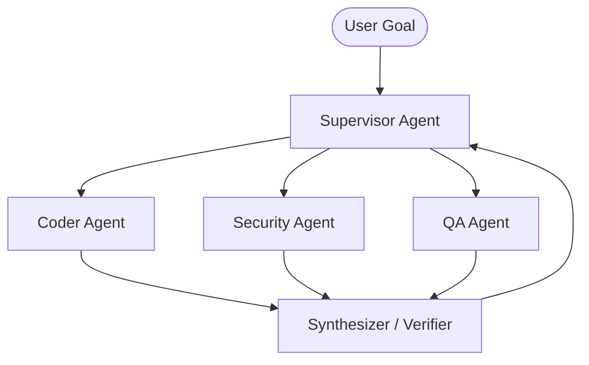

# Multi-Agent Topologies & Orchestration Patterns

---

## 1. Hierarchical Supervisor Pattern
A centralized Supervisor agent orchestrates specialized worker agents:
- **Architect Supervisor:** Manages global state, decomposes goals, assigns tasks.
- **Worker Agents:** Code generator, Test runner, Security auditor, Doc writer.

---

## 2. Sequential Assembly Pipeline
Each agent performs a stage of transformation and passes verified state to the next:
`Ingestion Agent` ──► `Analysis Agent` ──► `Synthesis Agent` ──► `Verification Agent`

---

## 3. Peer-to-Peer Blackboard Architecture
All agents subscribe to a shared blackboard (state bus), responding autonomously when conditions match their triggers.
